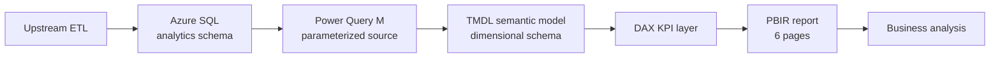
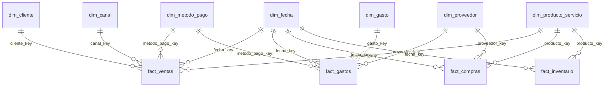
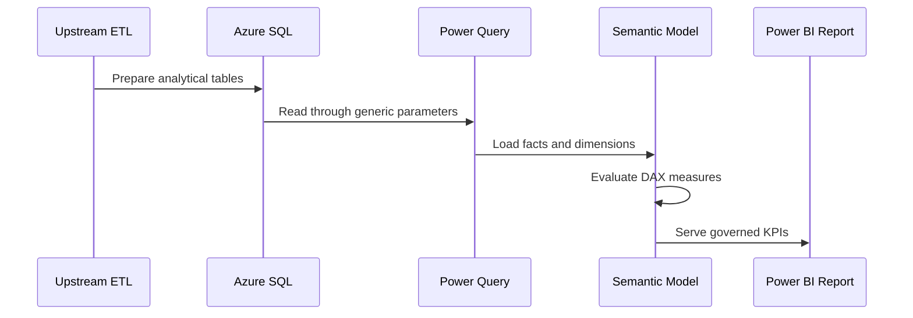
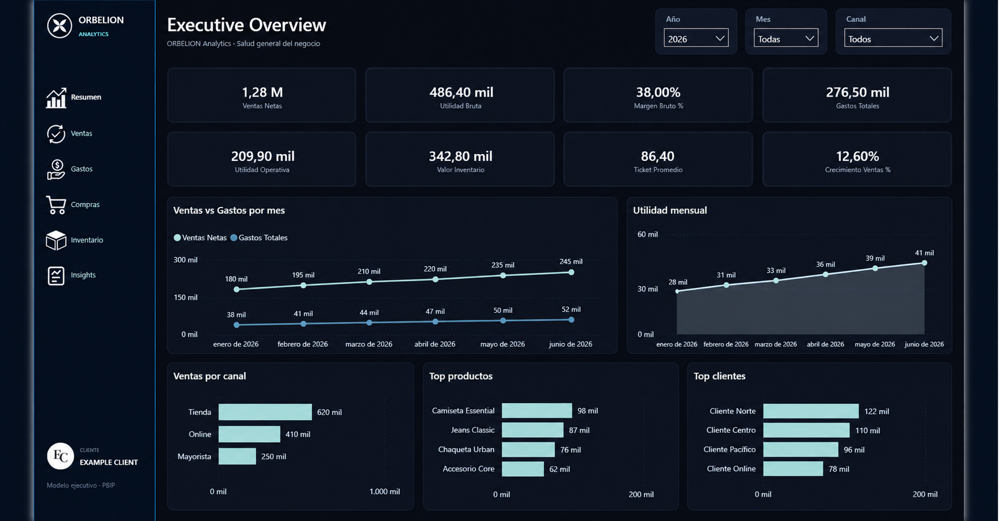
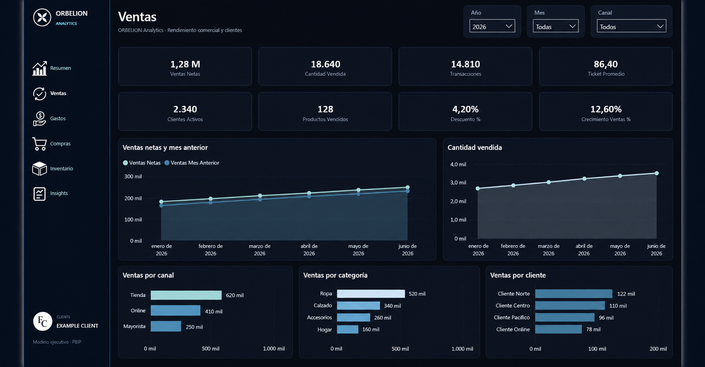
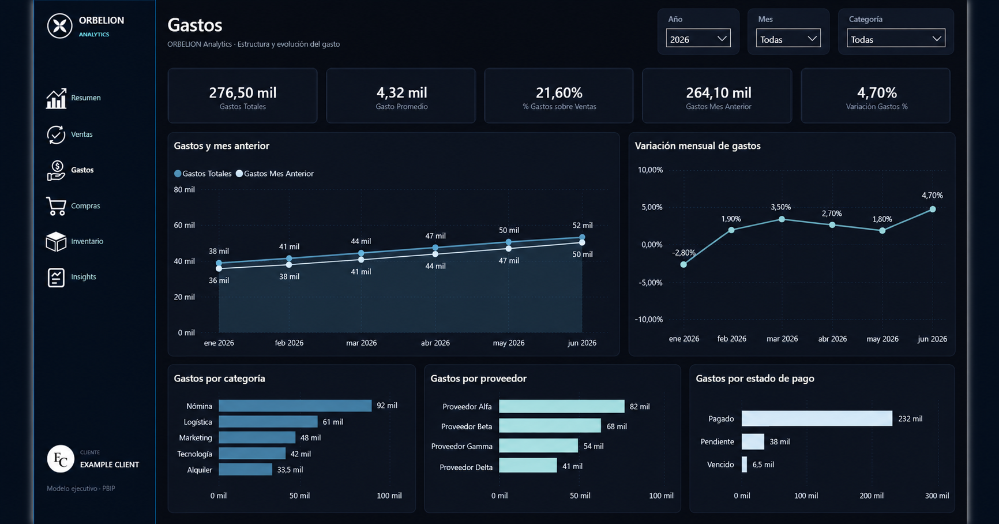
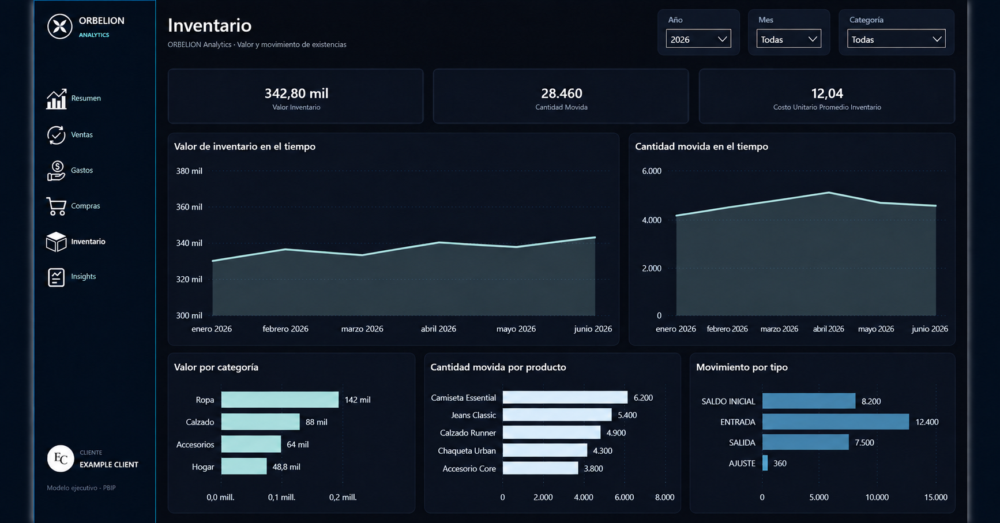

# ORBELION Power BI Analytics

## Overview

ORBELION Power BI Analytics is an independent business intelligence case study built with Power BI Project (PBIP) assets. It demonstrates semantic modeling, DAX-based KPI design, report engineering, Power Query, and Git-friendly BI development without publishing production data or infrastructure details.

This public repository contains sanitized documentation and representative code only. It does not contain customer data, credentials, production connection values, or the private report definition.

## Business Problem

Operational data for sales, expenses, purchases, and inventory must be transformed into a consistent management view. The analytical layer needs shared definitions, reliable time comparisons, navigable report pages, and source-controlled artifacts that can be reviewed independently of a binary `.pbix` file.

## Solution

The verified implementation uses:

- a parameterized Power Query connection to an upstream Azure SQL analytical source;
- a dimensional semantic model with fact and dimension tables;
- a centralized DAX measure table with 36 measures in six display folders;
- six report pages for executive and functional analysis;
- PBIP, PBIR, and TMDL files that support text-based Git versioning.

## Dashboard Architecture



Azure SQL is an upstream data source only. This project is not part of a finance portal and does not include an application or transactional write path.

## Semantic Model

The verified model contains four fact tables (`fact_ventas`, `fact_gastos`, `fact_compras`, and `fact_inventario`) supported by date, customer, product, channel, payment method, expense, supplier, and location dimensions. Measures are centralized in a dedicated technical table.

The public relationship summary and field-level inventory are documented in [docs/semantic-model.md](docs/semantic-model.md).

## Key KPIs

Only measures verified in the source project are listed:

| Business KPI | Verified DAX measure |
|---|---|
| Net Sales | `Ventas Netas` |
| Cost of Sales | `Costo de Ventas` |
| Gross Profit | `Utilidad Bruta` |
| Gross Margin % | `Margen Bruto %` |
| Total Expenses | `Gastos Totales` |
| Operating Profit | `Utilidad Operativa` |
| Inventory Value | `Valor Inventario` |
| Average Ticket | `Ticket Promedio` |
| Sales Growth % | `Crecimiento Ventas %` |

## DAX Measures

The model uses reusable base measures, ratio measures with `DIVIDE`, date intelligence, and explicit filter propagation for purchase analysis.

```dax
Ventas Netas = SUM(fact_ventas[total])

Utilidad Bruta = [Ventas Netas] - [Costo de Ventas]

Margen Bruto % = DIVIDE([Utilidad Bruta], [Ventas Netas])

Utilidad Operativa = [Utilidad Bruta] - [Gastos Totales]

Ventas YTD = TOTALYTD([Ventas Netas], dim_fecha[fecha])
```

The sanitized 36-measure catalog is available in [examples/measures.dax](examples/measures.dax) and [docs/measure-catalog.md](docs/measure-catalog.md).

## Data Model



## Report Pages

The report metadata verifies these pages in order:

1. Executive Overview
2. Ventas
3. Gastos
4. Compras
5. Inventario
6. Insights

Verified visual types include KPI cards, clustered bar charts, line charts, slicers, page navigation, action buttons, shapes, images, and text elements.

## Technology Stack

- Microsoft Power BI Desktop
- Power BI Project format (PBIP)
- Power BI report definition (PBIR)
- Tabular Model Definition Language (TMDL)
- DAX
- Power Query M
- Azure SQL / SQL connectivity through `Sql.Database`
- Git

## PBIP & Git Versioning

PBIP separates the report and semantic model into text-based definitions. PBIR stores page and visual metadata, while TMDL stores tables, relationships, expressions, and measures. This structure enables meaningful diffs, focused reviews, and independent Git history for BI assets.

The production PBIP is intentionally excluded from this public repository. The examples preserve verified modeling patterns without exposing source identifiers or report content.

## Data Flow



## Screenshots

The following publication-ready screenshots preserve the verified dashboard structure while using a fully synthetic `EXAMPLE CLIENT` scenario. Values, dates, customer labels, product labels, suppliers, and client identifiers were replaced; the images do not represent any real company's performance.

### Executive Overview



### Sales Analysis



### Expense Analysis



### Inventory Analysis



See the [asset publication notes](docs/assets/README.md) and [screenshot privacy checklist](screenshots/README.md) before adding or replacing images.

## Engineering Decisions

- Centralize business logic in a dedicated measure table.
- Organize measures into numbered display folders for discoverability.
- Use a dimensional model across sales, expenses, purchases, and inventory.
- Use `DIVIDE` for safe ratios and standard DAX time-intelligence functions for period analysis.
- Parameterize the Power Query source instead of embedding environment-specific values in public artifacts.
- Keep the portfolio data-free except for explicitly labeled synthetic examples using `example_client`.
- Publish documentation and representative code rather than production PBIR/TMDL files that may carry sensitive metadata.

## Project Context

This is an independent Power BI Analytics project and public technical case study. An upstream ETL process may prepare analytical tables in Azure SQL, but the ETL implementation, private infrastructure, and any finance portal are outside this repository.

## Author

Axel Ortega
